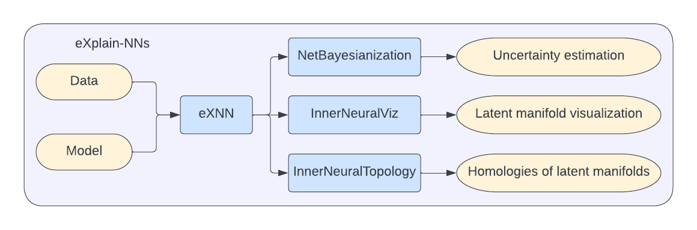

## Project Structure

eXplain-NNs Library includes the set of components:
* eXNN - module that contains core functionality
* tests - module that contains core functionality tests
* docs - module that contains documentation for the project
* examples - module with tutorials on eXplain-NNs Library

